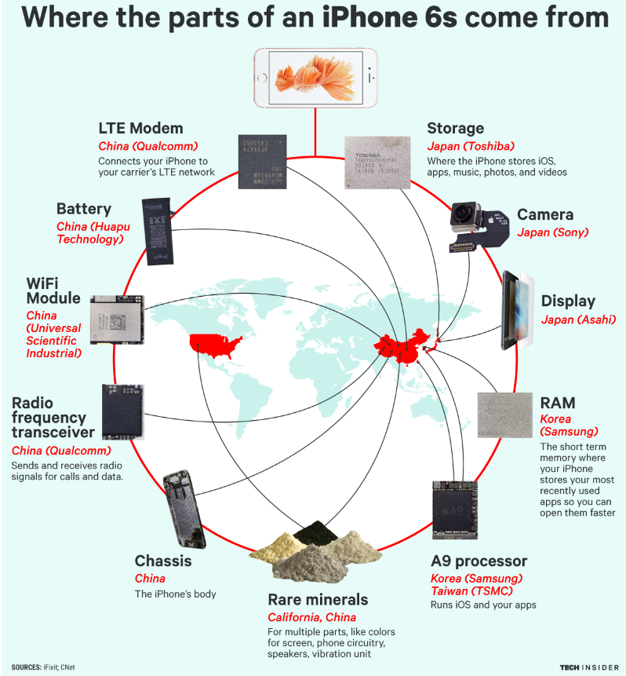
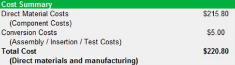
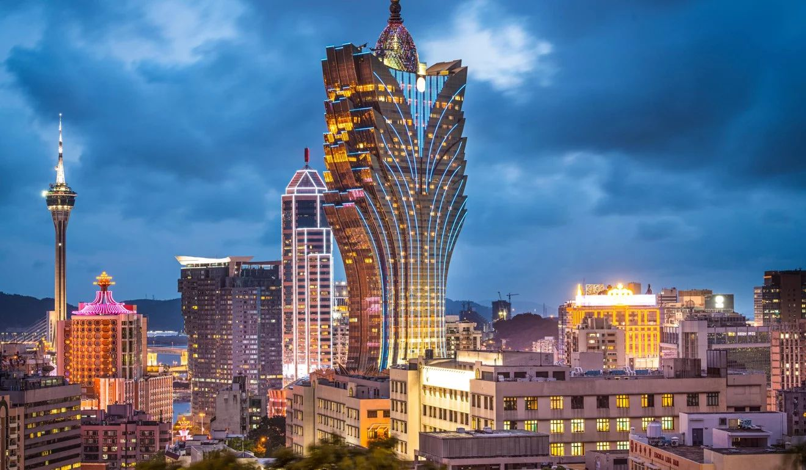
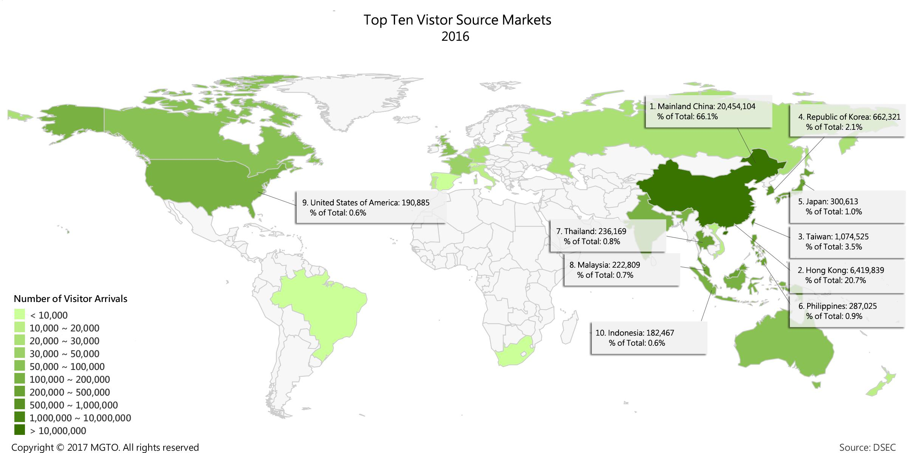
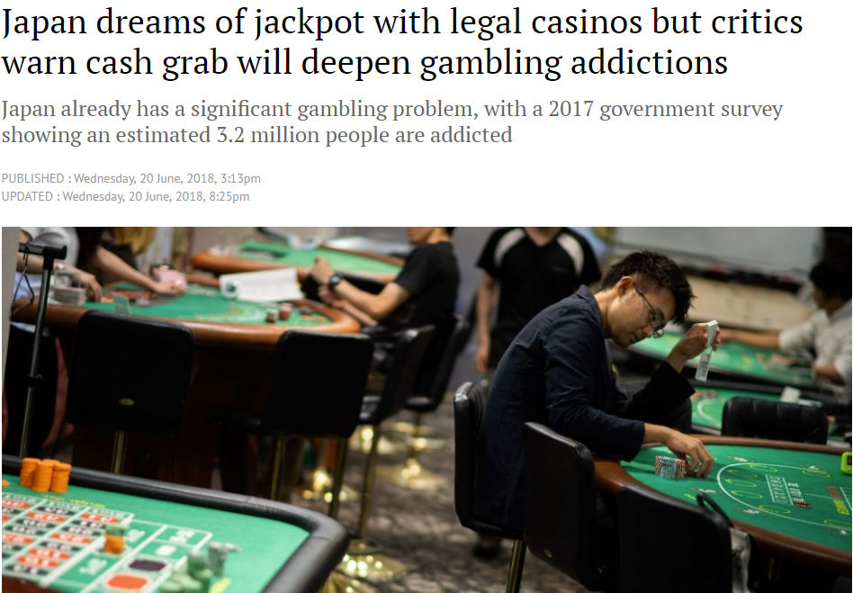
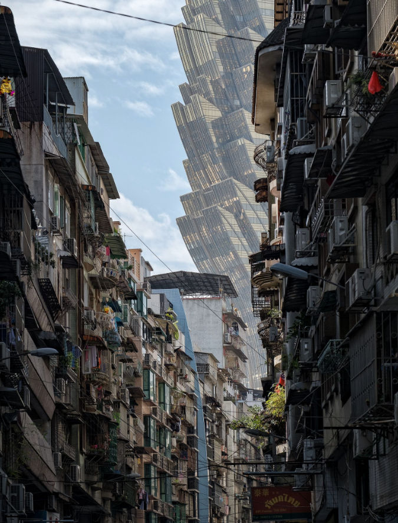
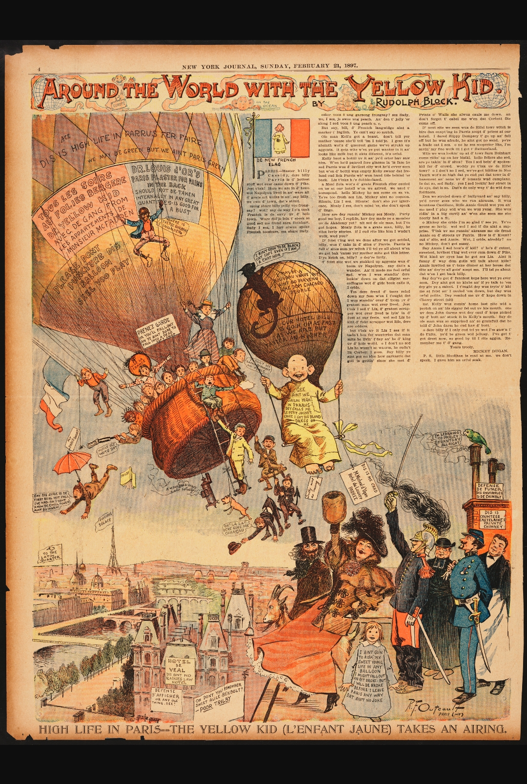

```{r setup, include=FALSE}
options(htmltools.dir.version = FALSE)
```

# Learning Objective
- Students will .orange[describe] basic knowledge of major issues and topics surrounding globalization and education in both industrialized and developing countries.

--

- Students will be able to .orange[identify] how variables such as class, race, ethnicity, gender, (im)migration, state, NGO, transnational entity, policy, etc. all play a role in the production of educational outcomes and to challenge dominant assumptions of globalization both in specific national settings and tans-nationally

--

- Students will critically .orange[evaluate] global issues of diversity, multiculturalism, decolonization, gender equity, and social justice that underline the common good of education.

---
## Learning Objective (cont...)
- Students will .orange[articulate] possible ways to think about globalization, its trends, issues, and impacts with relation to education and the fundamental task of preparing 21st-century citizens.

--

- Students will .orange[critique] dominant modes of international comparison, competition, as well as convergence and divergence of educational practices.

--

**Bottom line**: Think globally and act locally.

---
# Schedule
Weekly schedule can be viewed here:

- (http://bit.ly/2B7I7ex)
- This .red[.ics] file can be opened by most calendar software including the ones on your smartphone (i.e. Outlook, Calendar on iOS, or Google Calendar)
- Or better, you can _subscribe_ to this calendar. This way if I make any changes, your calendar will sync with mine.


---
# Assessment

Your grade consists 5 components:

- Writing exercise (4*5=20%)
- Group presentation (20+10=30%)
- Quiz (2*5=10%)
- Final paper (20+10=30%)
- Attendance (10%)

All the points from the 5 components will add up. The university has a metric to convert it to grade (F-A).

--

Read .red[course syllabus] for details.

---

## Other issues

Form your 4-member presentation group. Email the list and presentation topic to Ms. Tong or Ms. Lam by week 2 (Aug 30).

--

We will setup a WeChat help group for instant help.

--

Do bring your laptop or tablet. Might be easier for typing?

--
### .yellow[QUESTIONS?]

---
# Globalization, a short genealogy

---

## Globalization is a relatively new English word

It was first used by the Scottish educator .yellow[William Boyd]. His book in 1930 titled _The history of western education_, in which he denotes a holistic view of education:

--
>Wholeness, ..., integration, globalization ... would seem to be the keywords of the new education view of mind: suggesting negatively, antagonism to any conception of human experience which over-emphasizes the constituent atoms, parts, elements (Boyd & MacKenzie, 1930, p.350).

---
## In its original term

Boyd was referring to a popular idea in education psychology at that time, which refers to the ".green[globalization function stage]" in a children's development highlighted ans served as a new concept in the early 20th century ".green[new education]" movement. 

--

This term refers to a pedagogical system 教學體系 for teaching children to read. But as we now never used the term like this, the education concept died out fairly quickly.

---

## Globalization in today's context

According to Manfred Steger (p.1):
> A .violet[complex] and .violet[uneven] .red[dynamic] linking the .violet[local] (and national and regional) to the .violet[global], as well as the West to the East, and the North to the South. 

.footnote[
Reference: Steger, M. B. (2017). _Globalization: A Very Short Introduction_. Oxford University Press, Oxford and New York, 4th edition.
] 

---
## Globalization in today's context

According to George Rizter & Paul Dean:
>globalization is a .violet[transplanetary] .red[process] or set of .red[processes] involving increasing .red[liquidity] and the growing multidirectional .red[flows] of people, objects, places, and information as well as the .red[structures] they encounter and create that are .red[barriers] to, or .red[expedite], those flows...

.footnote[.green[trans·planetary]: 跨越行星
]

---

## Keywords

- Complex 複雜的

--
- Uneven 不均衡的

--
- Dynamic / Process 動態過程

--
- Local & global 在地的與全球的; West & East; South & North

--
- Liquid & flows 流動的

--
- Structure 結構: barrier or expedite 阻礙或加速


---
# Exploring the definition

- What types of objects, people, and information might be involved?
--

- What types of .orange[structures] could help or hinder their flows?
--

- What answers does this definition suggest? Is it .orange[new]? Has it .orange[happened]? Is it .orange[inevitable]?

---
class: middle, center

# How is globalization relevant to me?

---

background-image: url(../pic/iphone1.png)
background-size: contain

---


.footnote[
Image credit: [Business Insider](http://www.businessinsider.com/where-iphone-parts-come-from-2016-4)]

---
## Example 1: What makes iPhone a successful globalization case?

Global manufacturing networks:

--
- Technical know-how 專有技術
- Process lines 生產線
- Natural resources (e.g. rare earth elements 稀土)
- Human labor 勞動力
- Management 管理
- Design 設計
- Marketing 市場營銷

--

These things are not simply sitting there idle. They are constantly changing & self-reinforcing:

--
- What display does Apple use?
- Who is supplying Apple with the glass?


---
### Uneveness of globalization



.footnote[
Image credit: [9to5mac](https://9to5mac.com/2016/09/20/649-iphone-7-estimated-to-cost-apple-220-heres-the-component-breakdown/)]

--

iPhone 7 32GB version retails for .violet[US$ 649] (approx MOP5,200).


---
## Example 2: Macao's secret to success


.footnote[
Image credit: [SCMP](https://www.scmp.com/news/hong-kong/hong-kong-economy/article/2151036/macau-las-vegas-asia-trades-casino-chips-microchips)]

---
### Where do tourists come from?

--


Sheldon Adelson quote: ".orange[three billion (consumers) within a five-and-a-half- hour flight]"

.footnote[
Image credit: https://dataplus.macaotourism.gov.mo]

---
### Macao's success depends on several global factors

--

- Low competition in the region (.red[legal environment])
--

- Easy flow of currency in & out (.red[financial structures & regulation])
--

- Cheap labor cost (.red[people] who work in casinos, hotels, restaurants.) 

---
## What external factors could affect Macao?

--
### Competition


.footnote[
Image credit: [SCMP](https://www.scmp.com/news/asia/east-asia/article/2151618/japan-dreams-jackpot-legal-casinos-critics-warn-cash-grab-will)]

---
### Social inequality
.pull-left[


]

.pull-right[
"A quiet street in Macau. Modernization around is quickly changing the city." 

"A scene right out of Elysium" (online comments)

-- 
.footnote[
Image credit: [Paul Tsui/National Geography](https://travel.nationalgeographic.com/photographer-of-the-year-2018/gallery/peoples-choice-all/9/)]

[Elysium](https://www.imdb.com/title/tt1535108/) is a 2013 sci-fi film set in a hyper unequal earth.
]

---
### Resource on this topic

SCMP's recent report: [Macau: The incredible poverty at the heart of world's richest place](https://www.scmp.com/week-asia/society/article/2160251/macau-incredible-poverty-heart-worlds-richest-place)
- [Chinese translation](https://www.facebook.com/macauconcealers/posts/1798244593577967)
---
class: inverse, middle, center

# OK I get it. But does this have to do with education?


---
# We attach different meanings and aims to education

Some say education is a about .orange[skills] 技能 (hard skills or cognitive skills)

--

Some say education is about .orange[morality] 道德.

--

Some say education is about .orange[emotion] 情感.

---

## Various definitions of education
.green[Standard Western definition:] Education is the process of facilitating learning, or the acquisition of knowledge, skills, values, beliefs, and habits .red[<sup>1</sup>].

.green[Standard Chinese difinition:] If you learn without thinking about what you have learned, you will be lost. If you think without learning, however, you will fall into danger .kt[學而不思則罔，思而不學則殆。] (*Analectics* 2.15)
- "Learning is internalizing the actions, thoughts, and feelings of those who are virtuous" .red[<sup>2</sup>]

--

.footnote[
[1] https://en.wikipedia.org/wiki/Education ; 
[2] Van Norden, B. W. (p.29, 2011). *Introduction to classical Chinese philosophy*. Hackett Publishing.
]


---
# A different take on education

The standard definition treats education as a necessary process toward a utilitarian end, while the Chinese tend to view education as an end to itself. 

--

This is the goal I wish this course could fulfill. To elaborate on this, I borrow the definition proposed by sociologist Andrew Abbott: .red[_education is a way of having more experience in a given period_.]

--
- It is the ability to make more and more complex, more and more profound and extensive, the meanings that we attach to events and phenomena

--
- to be educated is to have the habit of finding many and diverse new meanings to attach to whatever events or phenomena we examine

---
class: center, middle

## .violet[Why attaching endless new meanings to things should be in itself a good thing?]

--

### "The answer is this: by attaching more meanings to things, by bringing more of experience under our current range of meaning and extending our range to embrace more things in more complex and abstract or sometimes ambiguous ways, we in effect enable ourselves to experience more of life in a given present, a given now."

---

background-image: url(https://web.northeastern.edu/numa/wp-content/uploads/hashtag-yolo4.png)
background-size: contain

---
class: center, middle

### "Education is good in itself because it expands the range of your experience, both .cyan[temporally] and .cyan[spatially]. Education means figuring out how to arrange the .cyan[finite] things you can know, their varying levels of abstraction and detail, their mix of skill and data, fact and theory, so as to maximize the potential array of meaning that you can experience in the now."

.footnote[
temporally: 時間上; spatially: 空間上; finite: 有限的
]

---
### Education grants you a larger life

"Whatever your temporal and spatial present, education lets you live .red[more] within it, by bringing more meanings into play, by creating a dialogue of complexity and simplification, of distinction and analogy, that transforms your immediate world and reaches beyond it."

--
.footnote[
complexity: 複雜; simplification: 簡化; distinction: 區別; analogy: 類比
]

---

### Being educated means adopting a habit

"that expands experience so as to overcome that provinciality by increasing ties between your locality and other human meanings. Sometimes abstraction is the mechanism for this, sometimes identification, sometimes grand simplification, sometimes the link goes through the tiniest of similar factual details, such as a similar eye color or a shared hometown."

--

"This flash of enlightenment, is the emergence of the habit of looking for new meanings, of seeking out new connections, of investing experience with complexity or extension that makes it richer and longer, even though it remains anchored in some local bit of both social space and social time."

--
.footnote[
provinc·iality: 偏狹觀念; abstraction: 抽象化; identification: 識別、鑑證
]

---

# What does this version of education has to do with globalization?

---
background-image: url(https://mfas3.s3.amazonaws.com/objects/SC226475.jpg)
background-size: contain

--

class: center, top
## The Museum Argument

.footnote[
Image credit: [Paul Gauguin 保羅·高更, 1897, Museum of Fine Arts Boston](https://www.mfa.org/collections/object/where-do-we-come-from-what-are-we-where-are-we-going-32558)]

---

### The Gauguin painting theme of the trio of questions:

- Where do we come from?
- What are we?
- Where are we going?

--

### Gauguin is certainly not the first artist tried to answer/present these questions. But he did so in an interesting time period with unique way:

- He fled Europe, the center of "civilized modern world", to the French colony of Tahiti (大溪地/塔希提) in 1891. 

---
background-image: url(https://www.biographyonline.net/wp-content/uploads/2016/02/burnley-mill-town-640x378.jpg)
background-size: contain

---
background-image: url(http://www.vam.ac.uk/__data/assets/image/0010/173485/Industrial_revolution_hdr.jpg)
background-size: contain

---

background-image: url(https://i1.wp.com/www.theirishstory.com/wp-content/uploads/2014/03/horse-drawn-tram-dublin.jpg)
background-size: contain

---

background-image: url(http://saxonhenry.com/wp-content/uploads/2015/06/Paul_Gauguin_-_Three_Tahitian_Women.jpg)
background-size: contain

---

background-image: url(https://hg-images.condecdn.net/image/XB8ep6d63Zp/crop/1620/f/Lot-18---Gauguin-house-15feb17-pr_b.jpg)
background-size: contain

---

- He believed life there was natural, filled with free love, gentile climate, and naked women. Tahiti is an outlier of the western world. Gauguin viewed such primitive place as an inspiration of his work. He tried to imitate local aesthetics into western artwork.

--
- This particular work filled with symbolism that Gauguin is famously known for.
	+ The baby on the right represents the beginning stage of life
	+ The women reaching for the apple: who are we?
	+ The elderly women: where are we going?
	+ goat: Christian symbol
- What made this painting famous?
	+ The saturated color
	+ Critiques say it has visual similarity of music

---
background-image: url(https://mfas3.s3.amazonaws.com/objects/SC226475.jpg)
background-size: contain

class: center, top
## Education extends our being 

.footnote[
Image credit: [Paul Gauguin 保羅·高更, 1897, Museum of Fine Arts Boston](https://www.mfa.org/collections/object/where-do-we-come-from-what-are-we-where-are-we-going-32558)]


---


.footnote[
Image credit: [Ohio State University](https://cartoons.osu.edu/digital_albums/yellowkid/)]
]

---

"Yes, it's easy enough to look at the painting and to come up with things to think about it. But how much richer they are when you know already the many different traditions of imagining the visual world, when you can understand the detailed references the painter made to those traditions, .cyan[when your immediate knowledge of the painting's social and cultural context makes you literally see dozens of things that aren't there if you don't know those contexts]. It's the same argument." 

--

"The experience becomes “bigger” because you are educated. Not merely in the sense that you can look at the painting longer without being bored, .cyan[but also in that within a single look you will see more]. And note that education doesn't lie simply in knowing the whole of the dead list of facts and contexts of who taught whom and which style was which, .cyan[but rather in taking such facts as you do know and playing with them and the painting]."

--

.footnote[Source: Andrew Abbott/University of Chicago (https://aims.uchicago.edu/node/79)]

---

# Aims: to explore issues using the lens of globalization
- your own knowledge and experience of globalization
- the importance of studying social change
- definitions of globalization and associated problems
- key theoretical questions 
- understanding global .orange[flows], .orange[barriers], and .orange[structures]

---

# Global awareness: Your own knowledge and experience
I am hoping these questions would guide your choice of presentation & final project:

--

- How would you define globalization?
- What do you think is involved? Can you think of examples?
- Think about all the different places you have seen or heard the term used. Was it always used in the same way?
- Is there any educational process involved? What perspective or information would you make other known? 

---
### How do you experience globalization?

- e.g. the way you study, consume, socialize, eat, etc

--

### How do other people experience globalization? Is it the same everywhere? Is it benefiting every one? Is it liberating? Is it oppressive? alienating? 

--

-  a monk in Tang dynasty
--

-  a nomad from Kenya
--

- a domestic worker from the Philippines who residing in the U.S.
--

-  a rich 2nd generation Chinese student in Vancouver 
--

-  a pro-gamer in South Korea
