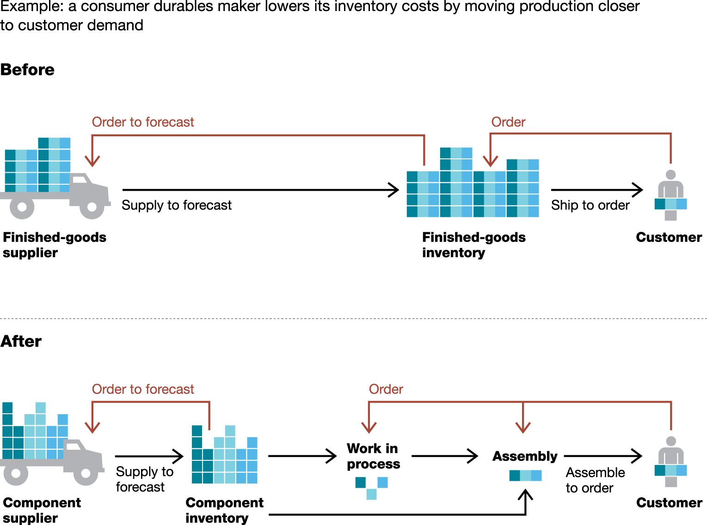
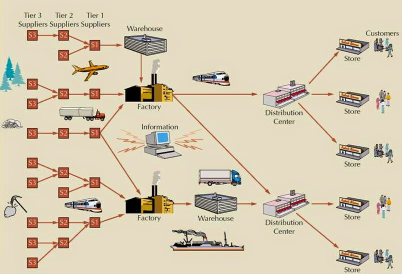
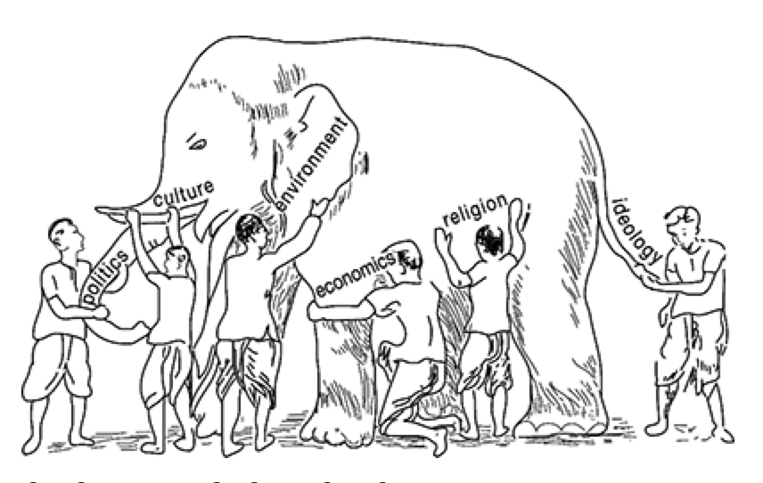

```{r setup, include=FALSE}
options(htmltools.dir.version = FALSE)
```
# Population change over time

<iframe width="560" height="315" src="https://www.youtube.com/embed/FNeGm2z11Qc" frameborder="0" allow="autoplay; encrypted-media" allowfullscreen></iframe>

---

# Useful metaphors

--

### 1. .red[Solids] 固態
- People, things, information, and places "harden" over time and therefore have limited mobility.

--

### 2. .red[Liquidity] 液態
- Increasing ease of movement of people, things, information, and places in the globe.

--

### 3. .red[Gaseousness] 氣態 
- Hyper-mobility of people, things, information, and places in the global age. 

---
class: inverse, middle, center

# All That Is Solid Melts into Air. 一切固定的東西都煙消雲散了。

---
## Global flows

Karl Marx said it in _Communist Manifesto_ (1848).

--

From solids to liquids to gases
- lighter
- move faster
- doesn't have concrete form

--

Includes the movement of:
- .violet[people]: migrants
- .violet[things]: materials and goods
- .violet[information]: data of all sorts
- .violet[places]: all kinds of "clone" towns in China


---
## The ways we make things become more "fluid"


.footnote[
Image credit: [McKinsey](http://www.mckinsey.com/business-functions/operations/our-insights/building-the-supply-chain-of-the-future)]
]

---

## Who is using it?

--
- .orange[Print on demand] (隨需列印) by Amazon: (https://www.quora.com/How-does-Amazons-on-demand-book-printing-work)
- .orange[Just in Time] (即時化生產) by Zara and Uniqlo: (https://theleadershipnetwork.com/article/supply-chain-management/zara-uniqlo-supply-chain)

---
### Print on demand: It doesn't matter if a publisher drops you

.pull-left[

]

.pull-right[

]

---
### What makes Weir's novel a success?

--
Globalization harness the power of the long tail.


.footnote[
Image credit: [Chris Anderson](http://www.longtail.com/about.html)
]

---

### A large number of small consumers (i.e. the long tail) who are connected by a universal platform

--
A self-publishing model that keeps writer motivated:
- Doesn't require book publisher to stock up physical books.
- Significantly reduce the cost of getting book published.

---

### Zara & Uniqlo's supply chain


---
### What makes Zara & Uniqlo a success?

.yellow[low cost & variaty of products]

--

Why is it possible?
- Global logistic network
- Information processing capabilities to track consumer demand and inventory almost real-time
- Light on inventory (e.g. they don't stock on final product. Instead, on fabrics and materials)

---

## What is the implication? (people, things, information, places...)

For many modern business, globalization enables them to:
- Get rid of the .red[solids]: less inventory, less warehouses, less people

--
- Disrupting the industry: book publishers are dying; department stores are dying; require different manufacturing process

--
- Centralization & Decentralization (中心化和去中心化): New centers arises and old centers destroyed

--
- Demand new type of skills and knowledge:
	+ information processing
	+ optimization
    + financial models
    + operation 

---
# Metaphors
### 4. .red[Flows]:

---
background-image: url(http://wx4.sinaimg.cn/mw690/006HJgYYgy1fhh0c3ye68g30b40b4tz8.gif)
background-size: contain

---
# Metaphors
### 4. .red[Flows]:
- .green[Interconnected flows]: e.g. global fishing industry
- .green[Multidirectional flows]: e.g. information flow
- .green[Conflicting flows]: e.g. global "war on terror" and global terrorist networks
- .green[Reverse flows]: e.g. air pollution pushed from one country to another

---
# Metaphors
### 5. .red[Barriers]:
- .green[Material structures]: e.g. border controls

--
- .green[Deliberate blocks]: e.g. government prevention of foreign ownership; censorship of information

--
- .green[Subtler structural barriers]: e.g. disadvantaged – poor, minorities, etc.

Barriers are __created__, can change, and do not impact people evenly.

--
### 6. .red[Structures]: set of processes that may either _impede_ or _block_ flows or to serve _expedite_ and _channel_ them.
- e.g. global financial structure

---
## Going back to iPhone/Apple example

--
What are the solids/liquid/gas?

--
- Apple does not hire all these workers at the assembly line. They are all outsourced/contractor.

--
- Apple constantly changes iPhone's technology so it wants ".cyan[flexibility]".

--
- Apple build its product by large numbers, so it want ".cyan[scale up]" really quickly.

### Questions

What is flexibility? What is scale up? Can you explain?

---

### What are the flows?
- Financial flow?
- Hard materials?
- Information?

--

### What are the barrier?
- Import taxes
- Labor regulation (how many hours should a worker work)
- Government censorship on information
- Consumer taste differences

---
class: middle, center

# These are great things by large, but are they inevitable?

---

The often-repeated rhetoric that globalization (the process) leads to more globalization (the condition) .violet[does not] allow us to draw meaningful analytical distinctions between causes and effects

--

Even we can pretty much all agree that we live in a globalized age, we can still find examples of angry people shouting .violet[no more globalization].


---
## Backlash against globalization Example 1: Brexit


.footnote[Image credit: [PBS Newshour](http://www.pbs.org/newshour/making-sense/column-theres-backlash-globalization-needs-change/)]


---
## Backlash against globalization Example 2: Donald Trump became president of USA


.footnote[Image credit: CNN]

---

# The great globalization debate

--

.red[Globalists] 支持全球主義者 – believe that there is such a thing as globalization and that it encompasses virtually the entire globe.

--

.red[Skeptics] 懷疑論者 – believe that there is no such thing as globalization, that it is an over-simplification of complex processes.

---

## Globalists' view

--

Majority of world enmeshed in globalization, both as a general process and as multiple globalizations.

--

.violet[Nation-state] (民族國家) being supplanted as main actor, with .violet[multilateralism] (多邊主義) emphasized.

--

Multi-layered global governance.

--

Transnational economy of MNCs (.violet[Multi National Cooperations]) and global division of labor.

--

Global popular culture and decline of fixed political identities.

---

## Skeptics' view

--

No one process of globalization but many.

--

Nation-state still vital and reasserting itself, with inter-governmentalism emphasized.

--

Global order still through international order of nation-states.

--

National economies still central and few true MNCs.

--

Global culture thesis exaggerated/declined, national and regional cultures reasserted.

---

## Question: Why is it the case?

Because globalization is .violet[uneven]:
- Some people gain more than others
- Intractable harms could be done
- Can cause rippling political/socioeconomic consequences

--
_Can you think of any examples? or elaborate on previous cases?_


---
## Globalization is a process

Because there are backlashes and push-backs, Globalization is not a one-way street (e.g. globalization leads to more globalization). Manfred Steger believes:

--
- We should not assume that globality is already upon us

--
- Nor does the term suggest a determinate endpoint that precludes any further development

--
Instead, we should .violet[be able to imagine different social manifestations of globality]: one might be based primarily on values of individualism, competition, and laissez-faire capitalism, while another might draw on more communal norms and cooperative social systems. (more on this in later weeks)


---
## If we are already global, are we still national or local?

--
It is not to say that national and local communal frameworks have lost their power to provide people with a meaningful sense of home and identity. 

--
The weakening/strengthening of the national imaginary, ironically, could take place at the same time.
- The .violet[intensification of global consciousness] destabilizes and unsettles the nation-state framework within which people have imagined their communal existence.

--
- On the other hand, the conflict and senses of urgency raised by globalization make us feel more connected with people around us

--
In fact, the national and local are changing their character and social functions as a result of our movement towards globality. At its core, globalization is about .violet[shifting forms of human contact].

---
## What role does education play in globalization?

Education as a means to increase economic competitiveness.

--
Education as a safeguard to defend local/national identify.

--
Education as a process to facilitate global flow.

--
Education as a critical approach to question globalization.


---
# Summary
## Some key characteristics of globalization

.violet[Key characteristics:] Notice that the conceptualization of globalization as a .orange[dynamic process] rather than as a static condition forces global studies scholar to pay close attention to new forms of connectivity and integration.

--
Think of the flow: it never cease to stop or being still.

---
## Some key characteristics
.violet[Key characteristics:] Intensification and acceleration of social exchanges and activities. It involves both the .green[creation] of new social networks and the .green[multiplication] of existing connections that cut across traditional political, economic, cultural, and geographical boundaries.

Remember: $1 + 1 > 2$ in many cases

---
## Some key characteristics
.violet[Key characteristics:] Another quality of globalization is reflected in the .green[expansion] and the .green[stretching] of social relations, activities, and connections. 

--

How many of "friends" do you have on facebook or WeChat?

--

.violet[Key characteristics:] globalization involves the .green[intensification] and .green[acceleration] of social exchange and activities. 

---

background-image: url(http://2oqz471sa19h3vbwa53m33yj.wpengine.netdna-cdn.com/wp-content/uploads/2018/05/internet-minute-2018.jpg)
background-size: contain


---
## Some key characteristics

.violet[Key characteristics:] globalization processes do not occur merely on an objective, material level but they also involve the subjective plane of .green[human consciousness]. Without erasing local and national attachments, the compression of the world into a single place has increasingly made global the frame of reference for human thought and action. Hence, globalization involves both the macro-structures of a 'global'' community and the micro-structures of 'global personhood'. 

---
## Globalization scholars and the elephant
