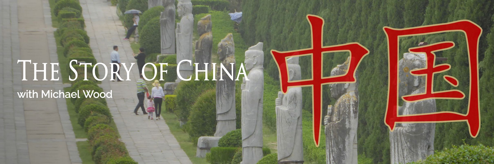

```{r setup, include=FALSE}
options(htmltools.dir.version = FALSE)
```

# Does globalization only happen as of now?

--

## Hardwired theory

Nayan Chandra<sup>.red[1]</sup> claims globalization stems from a: .orange[basic human urge to seek a better and more fulfilling life].


Can be traced back to first movements of human species, part of early human history.


Has included activities of: trade 貿易, missionary work 傳教, adventures 冒險, and conquests 征服.


Therefore globalization is nothing new.

.footnote[[1] Chanda, Nayan. 2007. _Bound Together: How Traders, Preachers, Adventurers, and Warriors Shaped Globalization_. New Haven: Yale University Press.]

---

## This view has been supported by empirical evidence

<iframe src="https://giphy.com/embed/qWjNXQAb3oA5G" width="960" height="642" frameBorder="0" class="giphy-embed" allowFullScreen></iframe><p><a href="https://giphy.com/gifs/human-evolution-qWjNXQAb3oA5G">via GIPHY</a></p>


---

background-image: url(https://media.nationalgeographic.org/ooew/thumbnail_cache/30/af/30afef224b83acaf3e29fdbb07d48507.jpg)
background-size: contain

.footnote[Image credit: [National Geography](https://www.nationalgeographic.org/projects/out-of-eden-walk/media/2013-03-the-greatest-walk/)]

---
background-image: url("./pic/bhp-timeline_opt.jpg")
background-size: contain

### Some scholar pushes this date even further: Exchange of information is a fundamental element at the life's origin

.footnote[Image credit: [David Christian/Big History Project](https://www.bighistoryproject.com/).
]

---

background-image: url(https://upload.wikimedia.org/wikipedia/commons/thumb/8/8a/Dna-base-flipping.svg/400px-Dna-base-flipping.svg.png)
background-size: contain

---

<a href="/gif/dna-replication-animation-by-interact-medical-wXAIWq" title="DNA replication animation by interact Medical"></a><div style="font-size:11px;">make <a href="/" title="make a gif">funny GIFs</a> like this at MakeaGif</div>

---
## .violet[Phases theory]

Several great phases or waves of globalization are identified, each with their own point of origin.

These phases happened sequentially, building on each other, and so this is different to the cycles theory.

--

.orange[Human migration history]

- The prehistoric period (10000 BC - 3500 BC)
- The premodern period (3500 BC - 1500 AD)
- Early modern period (1500 - 1750)
- The modern period (1750 - 1980s)
- The contemporary period (1980s - current)

---

### The Prehistoric period: the Great Divergence
Human being emerged slowly from a .green[single origin] (East Africa) but gradually moving and diversifying all over the world.

Globalization was very limited due to .green[lack of advanced technology] to overcome existing geographical and social obstacles. Long-distance interactions never materialized. 

Very .green[limited social-political structures]: from hunters and gathers to settlers and farmers. Human first learn producing their own food. Surplus of food create new social classes (craftsman, bureaucrats, soldiers).

--

### The premodern period

New technology: .green[writing] (Mesopotamia 美索不達米亞, Egypt, and central China) and .green[wheels] (Southwest Asia).

Wheels allows .violet[faster and more distant travel]. Writing allows the .violet[spread of ideas and inventions]. Writing also facilitated the .violet[coordination of complex social activities] and thus encouraged large state formations.

---

### At late stage of premodern period

.green[Empires] emerged, resulting vast territorial accumulations:

- Egyptian Kingdoms 古埃及王國
- Persian Empires 波斯帝國
- Macedonian Empires 馬其頓王國
- American Empires of Aztec and the Incas 南美洲印加與阿茲特克帝國
- Roman Empire 羅馬
- Indian Empire 印度
- Byzantine Empire 拜占庭
- Islamic Caliphates 伊斯蘭哈里發國
- Holy Roman Empires 神聖羅馬帝國
- African Empires of Ghana, Mali, and Songhay 非洲帝國
- Ottoman Empire 奧托曼帝國
- Chinese Empire 中華帝國

---

### Global trade started at this stage


.footnote[Image credit: [The Cambridge World History](https://www.cambridge.org/core/books/cambridge-world-history/trade-and-commerce-across-afroeurasia/B866E0C4A8DB0316091A6ABF77410D59)
]

---

### Global trade expanded the economic and cultural exchange

Large scale migration becomes possible. 

Urban cities emerged.

Major religions emerged (Judaism 猶太教, Christianity, Islam, Hinduism 印度教, Buddhism)

Downside is with more human interaction, more .green[infectious disease] such as .green[plague]. The enormous plague of the mid-14 century killed up to one-third of the population of China, the Middle East, and Europe.

.footnote[.green[infectious disease] 傳染性疾病; .green[plague] 瘟疫] 

---

### Modern Human migration: A visualization

We now have the technology to show in great detail how human move from place to place. In this video, pay special attention to Paris, as the cultural, political, economic, and education center of the Europe in 18th century: 

<iframe width="560" height="315" src="https://www.youtube.com/embed/4gIhRkCcD4U" frameborder="0" allow="autoplay; encrypted-media" allowfullscreen></iframe>

---

## .violet[Cycle theory]

Globalization is a long-term cyclical process.

Understanding the cycles rather than a single point of origin is most important.

Therefore again globalization is nothing new.

The current "global age" will pass and eventually be replaced by a new globalization.

--

## .violet[Events theory]

It is possible to point to specific events as the origin of globalization.

Many can be identified – some are events that took place over time, others are exact days, such as:

-  Roman conquests
-  "Discovery" of America (by who? Christopher Columbus? Native Americans?)
-  The first transatlantic telephone cable (1956)
-  Terrorist attacks of September 11, 2001

---
## When should we count globalization? 

Some would prefer to capture its contemporary uniqueness: .orange[post-1989].
  
Some would prefer to include the start of .orange[industrial revolution].
   
Some argues that globalization is a continuation and extension of complex process that begin with the emergence of modernity (現代性) in .orange[the 1500s].
  
Still others argue that globalization should not be measured in mere decades or centuries. Rather, they suggest these processes have been folding for .orange[millennium] 千年. 

---

# Globalization in historical times

## .violet[What does globalization mean for people in pre-modern time?]
---

background-image: url(https://en.unesco.org/silkroad/sites/silkroad/files/SilkRoadMapOKS_big.jpg)
background-size: contain

.footnote[Image credit: UNESCO]

---

## The monk and the Silk Road



_The Story of China_ is a 6-episodes TV series introducing China's history to Western audiences. Our segment is from Episode 2.

.footnote[Note: This series is available on DVD from the UM library.]
---

background-image: url(./pic/xuanzang.jpg)
background-size: contain

.footnote[
Image credit: (http://daishinji.net/essay/genjoh.shtml)
]
---

## Has Xuanzang's journey changed China?

China discovered that it is not the only civilization in the world: in contrast with a chauvinistic stereotype <sup>[.red[2]]</sup>

Through (mis)translation: the Chinese began to believe that a soul that was as an imperishable part of one's humanity.

Xuanzang's journey embodied a systematic approach to learn from foreign cultures by localizing Buddhism in China.

- Buddhism first arrived China in Han Dynasty (206BC - 220 AD).
- Through generations of Chinese monks' work, Buddhism interacts with Daoism which produced the Zen school 禪宗, a truly "Chinese" version of Mahayana Buddhism 大乘佛教.

.footnote[[2] chau·vin·is·tic 沙文主義, ster·e·o·type 刻板印象]
---

## An openness toward all schools of thoughts

.pull-left[
.cyan[.kt[原文]:] 貞觀十有二年秋七月，詔曰︰「道無常名，聖無常體，隨方設教，密濟群生。詳其教旨，玄妙無為，觀其元宗，生成立要。詞無繁說，理有忘筌，濟物利人，宜行天下。」


.kt[.orange[大秦景教流行中國碑頌]是一座記述景教在唐代流傳情況的石碑。此碑扵唐建中二年（781年）2月4日由波斯傳教士伊斯（Yazdhozid）建立扵大秦寺的院中。]
]

.pull-right[
.cyan[_Translation_:] The way for humanity, at different times, different places, did not have the same name. And the great Sage, at different times and different places, was not the same human body. Over history, heaven ordained that true religion, would be established in different countries and different climates so that all the humanity can be saved. And we've considered the .orange[Christian scriptures] and have decided that, in all their essentials, they are about the core values of humanity, and we have decreed that they be propagated throughout the Empire. 
]

---
## Education through human interaction at times with limited technology

To be changed by the experience by others, which requires: 

- Openness toward new knowledge, culture, ways of being

- Curiosity about outside world

- Perseverance & hard work

The exchange of information is slow by today's standard. But humans never stopped looking for new sources of inspiration.

Such change might not be reversible (i.e. once you know/understand it, you cannot "un-know" it)

---
# Educating ourselves

We have talked about .cyan[YOLO] and how education helps us to attach new meanings to life in Session 1. 

Many of you have heard or read of Xuanzang's story through classcis such as _A Journal to the West_ or pop culture representation. By following Michael Wood's "reintroduction", we .cyan[make the familiar strange]. This is an essential step in learning/re-learning.

---
## Resources
- To read more about various theories of globalization, read Ritzer & Dean Chapter 2
- David Christian's TED talk (with Chinese subtitle) https://www.ted.com/talks/david_christian_big_history. He is credited to lead the .green[the Big History Project], which seeks a unified approach (controversial!) to teach history.
- Interested in the historical background of Xuanzang? Read: .kt[絲路、遊牧民與唐帝國：從中央歐亞出發，騎馬遊牧民嚴重的拓跋國家。]（2018）森安孝夫（著），張雅婷（譯） 。八旗文化。
