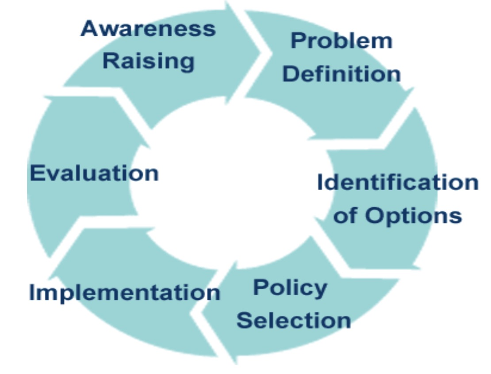

```{r setup, include=FALSE}
options(htmltools.dir.version = FALSE)
```

background-image: url(https://crsuccesslearning.com/wp-content/uploads/2017/10/prism.jpg)
background-size: contain

---

## Aims
Analyze multiple forces behind a global education phenomenon

Problemtize PISA


---

## Who is buying into PISA?
### Multiple stakeholder 利益相關者、持份人

.violet[OECD:] Advance its view of future economy

.violet[The media] 新聞媒體
- Talking points about national education, benchmarked against other nations
- League table is easy to understand

.violet[National & regional governments]
- to measure education quality 教育質量
- to be part of global education community
- to acquire technical expertise

.violet[Parents]
- Care if their children are losing out
- Care about school's quality

---

## Changing narrative
OECD's official account is typically __restrained__ 審慎. They are __balancing__ between selling PISA as an _innovative approach_ to understanding education and _overselling_ but couldn't live up to its promise: 

- PISA shows ".yellow[what's possible]" & ".yellow[similarities and differences in education around the world]"
- To help government rethink their own approach to education to improve their schools: to ".yellow[give every student the best opportunity to achieve the best results]"
- A description can be viewed here: https://www.youtube.com/watch?v=q1I9tuScLUA

---
## However, the media craves for more stories...


---

background-image: url(https://gdurl.com/H1fA)
background-size: contain

## Such obsession with ranking could not be backed up by the statistics

---

## League table reporting often leads to

Sensationalization of an ".red[educational crisis]"<sup>.red[1]</sup>:
- Japan<sup>.red[2]</sup>
- Alberta, Canada<sup>.red[3]</sup>


.footnote[[1] .green[Sensation·alize] 炒作

[2] http://www.tandfonline.com/doi/abs/10.1080/03050060802481413

[3] https://cdhowe.org/sites/default/files/attachments/research_papers/mixed/Commentary_488.pdf

]

---

background-image: url(https://gdurl.com/23Gz)
background-size: contain

---

background-image: url(https://gdurl.com/Pw3b)
background-size: contain

---

### Even some Chinese media is bashing Japan's education "failure"


.footnote[Source: https://www.guancha.cn/youyiwei/2016_08_06_370219.shtml]

---


.footnote[Source: https://crossing.cw.com.tw/blogTopic.action?id=927&nid=9563]

---

background-image: url(./pic/pisa-alberta.png)
background-size: contain

---

## The reporting of PISA creates a message that we can

.orange[Directly borrow educational practices from high performing systems:]
- curriclum (i.e. academic-focused curriculum)
- classroom setting (i.e. large class sizes)
- management approach (i.e. accountability of teachers 教師問責制)

__Assumption:__ transplant a new policy via rational policy planning

__Perceived benefit__: increase in PISA test scores, which implies pareparing young people as productive future workers in the knowledge economy.


---
## When you believe solving a problem is linear



---


background-image: url(./pic/policy2.jpg)
background-size: contain

### In reality
.footnote[Source: Sir Peter Gluckman - _Evidence informed policy making_ - 27 June 2017]

---

## Problemtizing PISA
### Issue 1: Global cultures and culture flows

If we treat PISA as a stream in global flow, is it
- Differentiating?
- Converging?
- Hybridizing? 

Some say seeing like PISA is buying into a particular way of managing education: .orange[governed by the numbers].<sup>.red[4]</sup>. That is, we reduced our understanding of education into number/statistics.

Leads to global assimilation in direction of dominant groups: those who are able to produce and disecting the number,  

Some call PISA as a form of .orange[cultural imperialism]: Where one culture imposes itself (more or less consciously) and tends to destroy at least part of another culture

.footnote[[4] http://journals.sagepub.com/doi/abs/10.1177/1474904116658299]

---

## Other thinkers say, not necessarily (about PISA's influence)

Subjective nature of cultural interpretation:

- If focusing on the strong flows and weak barriers, then they are .orange[converging]
- If focusing on the barriers to flows, then countries/regions are .orange[differentiating] themselves from the global learning metric
- If focusing on the interaction between internal and externals, then they are .orange[hybridizing]. 

---

## Two concepts related with cultural hybridization

.violet[__grobalization__] (grow + globalization): imperialist ambitions of nation-states, corporations, organizations, and the like and their desire to impose themselves on various geographic areas throught the world. _Their main interest is in seeing their power, influence, and in some cases profits grow_.


.violet[__glocalization__] (global + local): the interpretation of the global and local resulting in unique outcomes:
- the world is growing more pluralistic
- individuals and local groups have great power to adept, innovate, and maneuver (they are important and creative agents)
- social processes are relational and contigent

---

### Issue 2: What does the number say

Even if we buying into PISA, what does the number tell us?
    
It tells us about the skills. Skills presumed to be translated into labor market productivity.

More skilled labor forces moves the economy faster

PISA (math test reflecting skills level) score as a proxy for cognitive ability, analytical skills. 

---

## Does this logic chain 邏輯鏈 hold up?:

### .violet[A snapshot] of performance by .cyan[a particular group of] students on .brown[a particular school day].

```{r HC,echo=FALSE}
library(DiagrammeR)
m <- mermaid("graph LR;
            A(PISA 15 yr old) --> B(Human Capital <br /> at High school) 
            B --> C(Human Capital <br /> at the University) 
            C --> D(Human capital <br />as an adult) 
            D --> E{Economic <br /> growth}")
widgetframe::frameWidget(m, width='120%')
```
---

## Test reflects what is taught in school


.footnote[Source: http://science.sciencemag.org/content/323/5914/586]

---

## Issue 3: Setting educational agenda
.violet[Who is defining what is important in education]
- When global narrative penetrate locale education system
- Local? Regional/National government? 
- International agency?
- Teachers? Parents? Politicians? Researchers?

.violet[What is assessed and what is not]
- What curriculum? What kind of knowledge?
- Do you agree with it? Why
- What about: trust, self-understanding, empathy, collaboration, perseverance 

---

## The race narrows education purposes

>.violet[(Treating education as a race) takes the oxygen out of the debate of educational issues. ]-- Sam Sellar

What (other) issues does school concern?
- Grade retention
- Sex education
- School bullying
- Student disengagement
- ect

---

## Impracticality of education

Education researcher Tom Popkewitz describes education as partly .violet[impractical] 不實用的 <sup>.red[5]</sup>. Education always has a .violet[moral dimension] 道德層面的影響:

- Music education 
- Civil education
- Sports

Similarly, historian David Labaree argues that three functions of schooling:<sup>.red[6]</sup>
- .violet[Democratic equality]: education makes competent citizens for the society 
- Social efficiency
- Social mobility


.footnote[[5] Reference: https://soundcloud.com/freshed-podcast/cies-symposium-day-1-a-missing

[6] Labaree, D. F. (1997). Public Goods, Private Goods: The American Struggle over Educational Goals. _American Educational Research Journal, 34_(1), 39–81.]

---

## What is PISA useful for?
Surprisingly, the test score comparison itself does not reveal a whole lot about education and learning.

But it can be informative for other things (surprisingly helpful)

---

## Gender differences in math and science


---

background-image: url(https://i.pinimg.com/originals/20/31/b4/2031b47a80a0a06a085f658d6bfe947c.jpg)
background-size: contain

---

background-image: url(https://i.warosu.org/data/sci/img/0090/27/1499722725716.jpg)
background-size: contain

---

## Why would someone prefer reducing a complex social phenomenon such as education to numbers/statistics?

In the PISA case, globalization brings new angles for comparison.

Education is complicated, full of unexpected change and uncertainty.

We want answers, certainty, explanations. But how do we know we find one?: 

>We have an explanation of something when we have made a certain kind of _argument_ about it: an argument that is simple, exclusive, perhaps elegant or even counterintuitive. In this sense, an account is an explanation because it takes a certain pleasing form, because it somehow marries simplicity and complexity. <sup>.red[7]</sup>


.footnote[[7] Abbott, Andrew. _Methods of Discovery: Heuristics for the Social Sciences (Contemporary Societies Series)._ (2004, p.11).]

---

## Best of all? Everyone can get their piece of the story

Media: We know who is doing the best and who is in crisis!

Government: we have run a _scientific study_, and concluded that our education system is good/not good.

Government officials: Look at the authorities behind us! I am not lying

School principals: Come to our school


---


## .red[Summary]

PISA is a powerful form of culture flow. It moves more easily around the world than very before. 

Hybridization nature of PISA.

PISA is a complext enterprise that still carries tremendous momentum but also riddled with contradictions. 

---

## Resources:

Ritzer & Dean: p.215-216; p.226-227; p.231-233 

More discussion on PISA:
- http://www.freshedpodcast.com/tag/global-learning-metrics/ 9-episode discussion from different perspectives.

